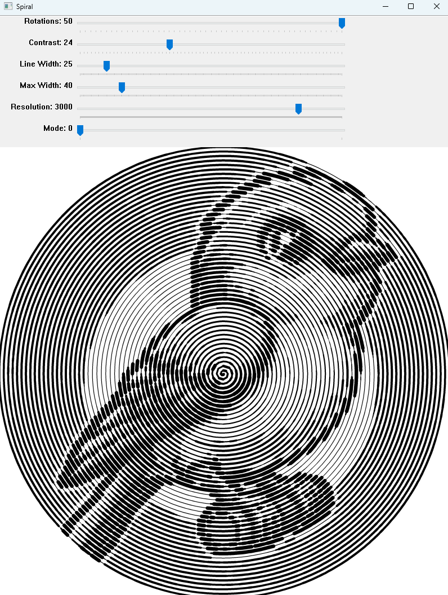

# Spiral Coloring Page Maker

The Spiral Page Maker is a Python application designed to create intricate spiral designs using images. This tool allows users to transform regular images into this unique art by drawing spirals that vary in thickness based on the grayscale value of the corresponding pixel in the original image.

## Spiral Designs Preview

Here are some examples of spiral designs created with the spiral Page Maker:

<p>
  
  
  
</p>

## Application Interface

This is what the Spiral Coloring Page Maker's interface looks like:



## Features

- Convert any image into a spiral design.
- Customize the number of rotations, contrast, line width, and maximum width of the spiral.
- Adjust the resolution of the output image.
- Choose between line and dot modes for different styles.
- Preview the outline image and the final spiral design in real-time.
- Save the generated spiral design and its outline to disk.

## Installation

To run, you need Python installed on your system. Additionally, the application depends on the following libraries:

- NumPy
- OpenCV

You can install these dependencies using pip:

```bash
pip install numpy opencv-python
```

## Usage

1. Clone the repository or download the source code.
2. **Prepare Your Image**: Move the image you wish to transform into the `images` directory within the project's directory. Rename it to `img.png` or update the `IMAGE_PATH` in the `spiral_page_maker.py` script to point to your specific image file. The default path for the image is `/images/img.png`.
3. Run the script:

```bash
python spiral_coloring_page_maker.py
```

4. Use the trackbars in the OpenCV window to adjust the spiral parameters.
5. Press 'q' to quit the application and save the generated images.

## Customization

- **Rotations**: Adjusts the number of rotations in the spiral design.
- **Contrast**: Influences the contrast between different parts of the spiral.
- **Line Width**: Sets the base width of the spiral lines.
- **Max Width**: Limits the maximum width of the spiral lines.
- **Resolution**: Determines the resolution of the output image.
- **Mode**: Switches between line mode (0) and dot mode (1) for different artistic effects.

## Saving the Output

The generated spiral design and its outline are saved to the project directory as `spiral.jpg` and `spiral_outline.jpg`, respectively, when you press 'q' to quit the application.
